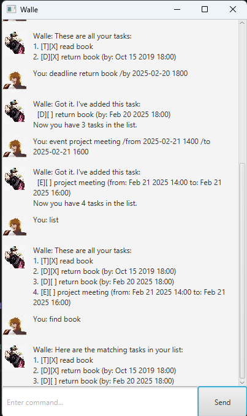

# Walle User Guide

**Walle** is a simple desktop task management chatbot that helps you keep track of todos, deadlines, and events using natural text commands through a graphical user interface (GUI).

---

## Product Screenshot

A representative screenshot of Walle is included in the repository at:

The screenshot shows the full application window with realistic task data and demonstrates key features such as adding tasks, listing tasks, and finding tasks.

---

## Getting Started

1. Launch the Walle application.
2. Type commands into the input box at the bottom of the window.
3. Click **Send** or press **Enter** to execute a command.

When the application starts, Walle will greet you and is ready to accept commands.

---

## Commands Overview

### View all tasks

Shows all tasks currently in your task list.

---

### Add a todo

Adds a task without any date or time.

Example:

---

### Add a deadline

Adds a task that must be completed by a specific date and time.

Example:

---

### Add an event

Adds a task that occurs over a period of time.

Example:

---

### Mark a task as done

Marks a task as completed.

Example:

---

### Unmark a task

Marks a completed task as not done.

---

### Delete a task

Deletes a task from the task list.

---

### Find tasks by keyword

Finds tasks that contain a keyword in their description.

Example:

---

### Undo the latest command

Undo the most recent command 

Example: Todo chores
         undo
         todo command will be automatically reverted

---

### Show help

Displays a list of all supported commands.

---

### Exit the application

Exits Walle.

Walle will display a goodbye message before closing.

---

## Notes

- Task numbers correspond to the numbering shown in the `list` command.
- Dates and times must follow the format `yyyy-MM-dd HHmm`.
- Tasks are saved automatically and loaded on startup.
- Clear error messages are shown for invalid commands or formats.

---

## Command Summary

| Command                                         | Description                        |
|-------------------------------------------------|------------------------------------|
| `todo <description>`                            | Adds a todo task                   |
| `deadline <description> /by <value>`            | Adds a deadline task               |
| `event <description> /from <value> /to <value>` | Adds an event task                 |
| `list`                                          | Lists all tasks                    |
| `mark <task_number>`                            | Marks a task as done               |
| `unmark <task_number>`                          | Marks a task as not done           |
| `delete <task_number>`                          | Deletes a task                     |
| `find <keyword>`                                | Finds tasks containing the keyword |
| `help`                                          | Lists all commands                 |
| `help <command_number>`                         | Shows detailed command help        |
| `bye`                                           | Exits the application              |
| `undo`                                          | Reverts most recent commad         |

---

